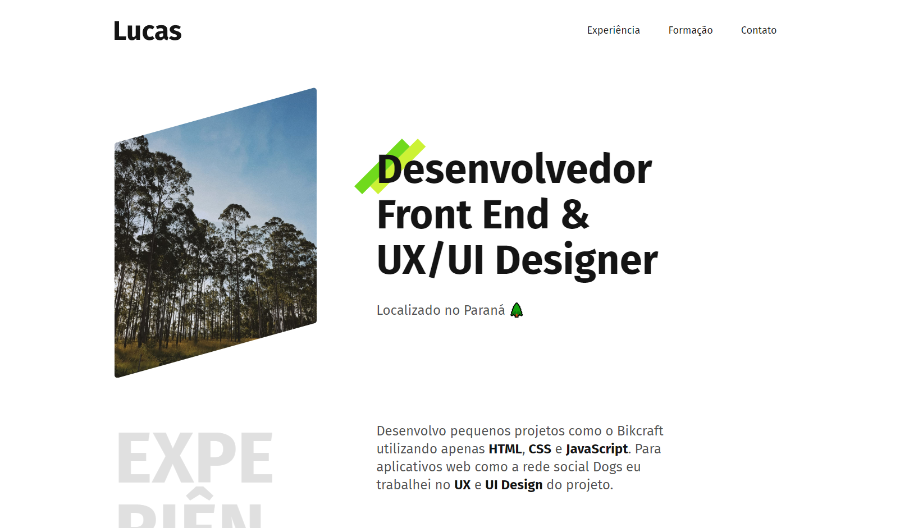

# Potfólio - aprimorando o CSS.

  

# 🎇 Tecnologias

Esse projeto foi desenvolvido com as seguintes tecnologias:

- HTML 5
- CSS 3

# 🎆 Sites utilizado para o desenvolvimento

- [Flexbox Guia Completo](https://origamid.com/projetos/flexbox-guia-completo/) - O Flexbox Guia Completo é um guia desenvolvido pelo André Rafael da Origamid
- [MDN - CSS](https://developer.mozilla.org/pt-BR/docs/Web/CSS) - O MDN Web Docs é o website oficial de Mozilla para desenvolvimento de padrões web.

# 🎯 Acesse ao projeto

Você pode acessar o site pelo link abaixo:

- [Portfolio](https://glistening-banoffee-82e405.netlify.app/) - O site está hospedado gratuitamente na Netlify

# 💼 Direitos

- Todos os direitos reservados por André Rafael - [Origamid](https://www.origamid.com/)  
- Feito por Lucas Cano.
